# Traffic Relay Node Placement Dataset

Welcome to the Traffic Relay Node Placement Dataset repository! This dataset has been curated for research and analysis in the field of traffic engineering and focuses on the placement of relay nodes. It contains two main sets of data: the sensor node set and the relay node set. Each node set includes the corresponding latitude and longitude coordinates, which are crucial for evaluating the performance of traffic networks and determining optimal relay node placements.

## Description
**The dataset is derived from real traffic scenes**: The data in this dataset has been collected from actual traffic scenarios, ensuring its authenticity and representing real-world traffic conditions. By using data from real traffic scenes, this dataset aims to provide valuable insights for traffic engineering research and practical applications.

## Usage

You are free to utilize this dataset for academic, research, or commercial purposes. If you find this dataset valuable for your work, please consider citing our paper and providing a link back to this repository.

## Dataset Details
| Dataset Name   | Sensor Nodes | Relay Nodes | Data Format | Sensor File         | Relay File          | Coordinate System |
|----------------|--------------|-------------|-------------|---------------------|---------------------|-------------------|
| #208 Dataset   | 208          | xxx          | CSV         | sensor_208.xls   | relay_208.xls    | WGS 84            |
| #456 Dataset   | 456          | xxx          | CSV         | sensor_456.xls      | relay_456.xls       | WGS 84            |
| #648 Dataset   | 648          | xxx          | CSV         | sensor_648.xls   | relay_648.xls    | WGS 84            |
| #848 Dataset   | 848          | xxx         | CSV         | sensor_848.xls   | relay_848.xls    | WGS 84            |
| #1136 Dataset   | 1136          | xxx         | CSV         | sensor_1136.xls      | relay_1136.xls       | WGS 84            |
| #1500 Dataset   | 1500          | xxx         | CSV         | sensor_1500.xls   | relay_1500.xls    | WGS 84            |

### #208 Dataset
- Number of sensor nodes: 208
- Number of relay nodes: 70
- Data format: CSV (Comma-Separated Values)
- Files:
  - `sensor_208.xls`: Contains sensor node information with columns "id", "Lng" (longitude), and "Lat" (latitude).
  - `relay_208.xls`: Contains relay node information with columns "id", "Lng" (longitude), and "Lat" (latitude).
- Coordinate System: WGS 84 (World Geodetic System 1984)
<!-- - 显示节点分布图像 -->
<div style="display: flex; justify-content: space-between;">
    <figure style="width: 49%; margin-right: 10px;">
        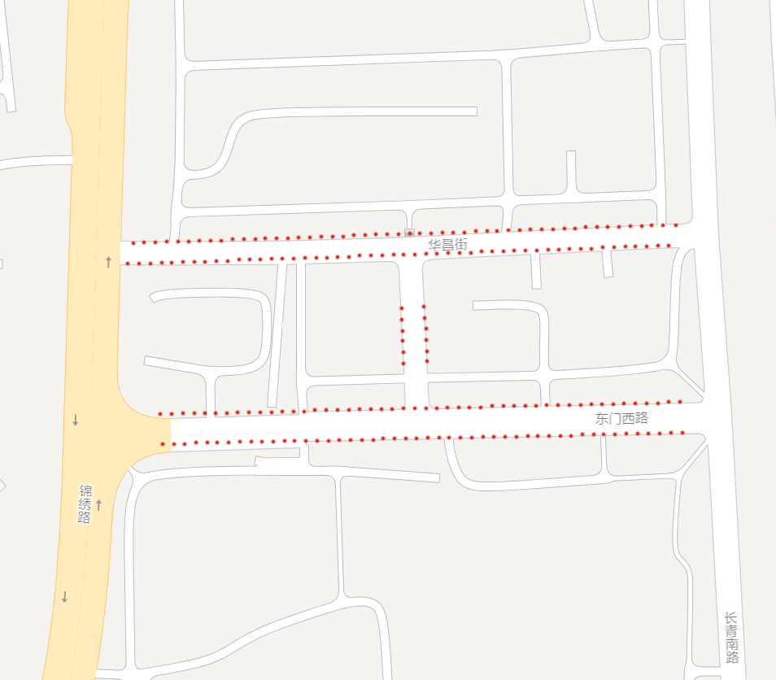
        <figcaption style="text-align: center;">#208 Sensor Distribution</figcaption>
    </figure>
    <figure style="width: 49%;">
        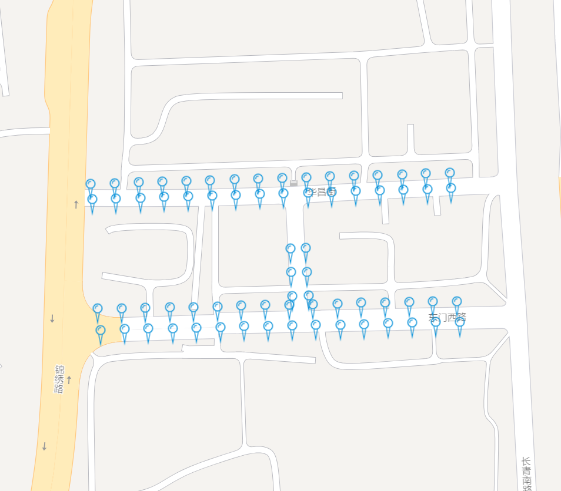
        <figcaption style="text-align: center;">#208 Gateway Distribution</figcaption>
    </figure>
</div>


### #456 Dataset
- Number of sensor nodes: 456
- Number of relay nodes: 148
- Data format: CSV (Comma-Separated Values)
- Files:
  - `sensor_456.xls`: Contains sensor node information with columns "id", "Lng" (longitude), and "Lat" (latitude).
  - `relay_456.xls`: Contains relay node information with columns "id", "Lng" (longitude), and "Lat" (latitude).
- Coordinate System: WGS 84 (World Geodetic System 1984)

<!-- - 显示节点分布图像 -->
<div style="display: flex; justify-content: space-between;">
    <figure style="width: 49%; margin-right: 10px;">
        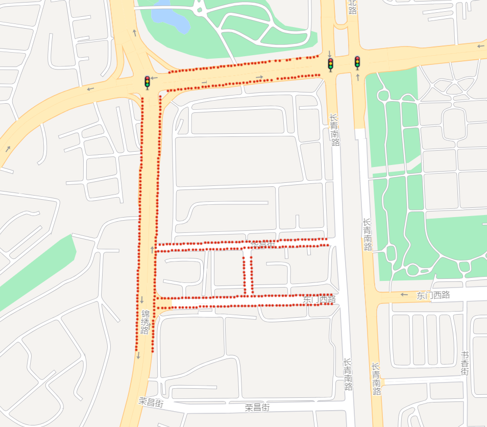
        <figcaption style="text-align: center;">#456 Sensor Distribution</figcaption>
    </figure>
    <figure style="width: 49%;">
        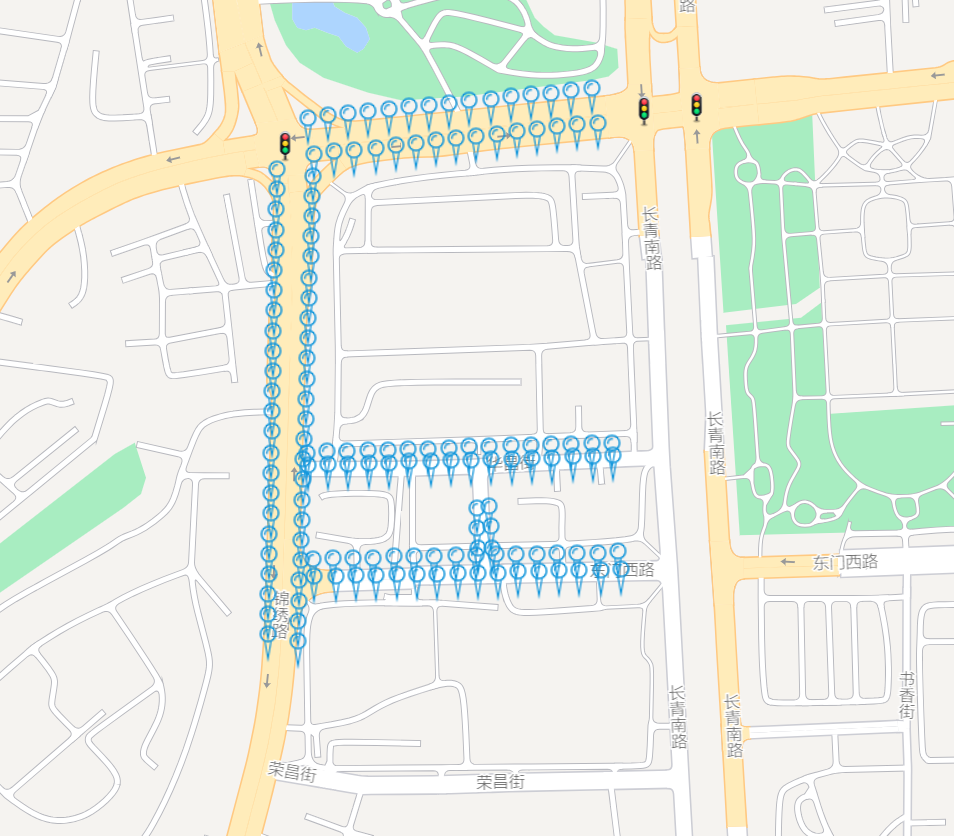
        <figcaption style="text-align: center;">#456 Gateway Distribution</figcaption>
    </figure>
</div>

### #648 Dataset
- Number of sensor nodes: 648
- Number of relay nodes: 223
- Data format: CSV (Comma-Separated Values)
- Files:
  - `sensor_648.xls`: Contains sensor node information with columns "id", "Lng" (longitude), and "Lat" (latitude).
  - `relay_648.xls`: Contains relay node information with columns "id", "Lng" (longitude), and "Lat" (latitude).
- Coordinate System: WGS 84 (World Geodetic System 1984)

<!-- - 显示节点分布图像 -->
<div style="display: flex; justify-content: space-between;">
    <figure style="width: 49%; margin-right: 10px;">
        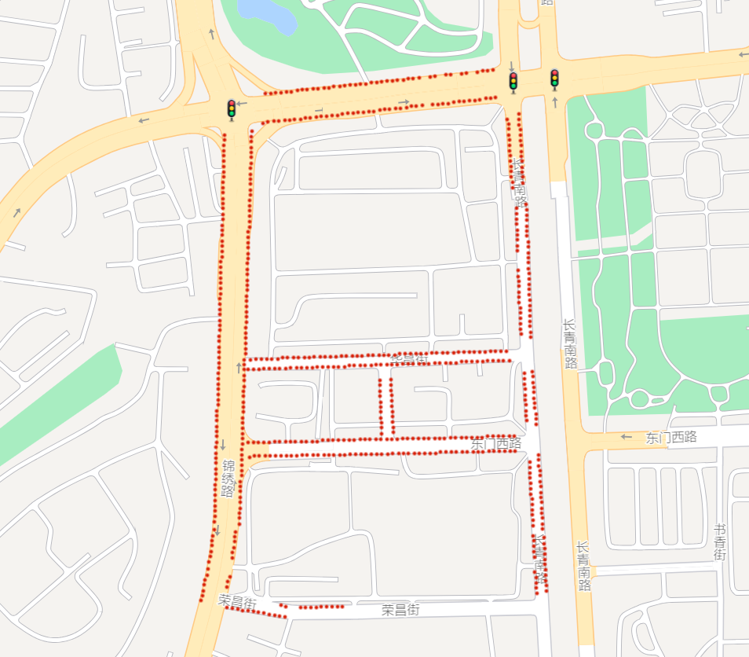
        <figcaption style="text-align: center;">#648 Sensor Distribution</figcaption>
    </figure>
    <figure style="width: 49%;">
        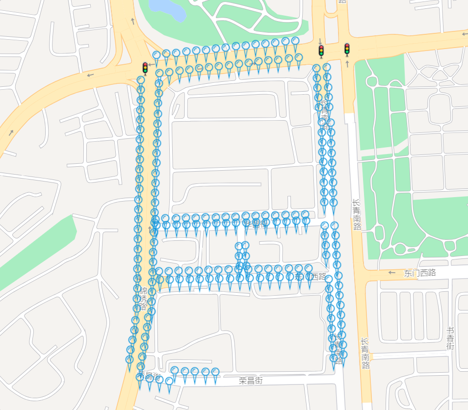
        <figcaption style="text-align: center;">#648 Gateway Distribution</figcaption>
    </figure>
</div>


### #848 Dataset
- Number of sensor nodes: 848
- Number of relay nodes: 290
- Data format: CSV (Comma-Separated Values)
- Files:
  - `sensor_848.xls`: Contains sensor node information with columns "id", "Lng" (longitude), and "Lat" (latitude).
  - `relay_848.xls`: Contains relay node information with columns "id", "Lng" (longitude), and "Lat" (latitude).
- Coordinate System: WGS 84 (World Geodetic System 1984)

<!-- - 显示节点分布图像 -->
<div style="display: flex; justify-content: space-between;">
    <figure style="width: 49%; margin-right: 10px;">
        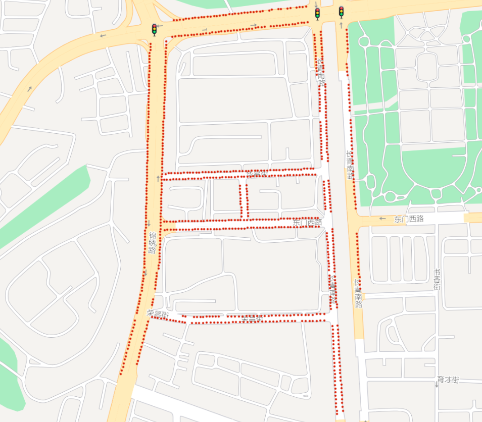
        <figcaption style="text-align: center;">#848 Sensor Distribution</figcaption>
    </figure>
    <figure style="width: 49%;">
        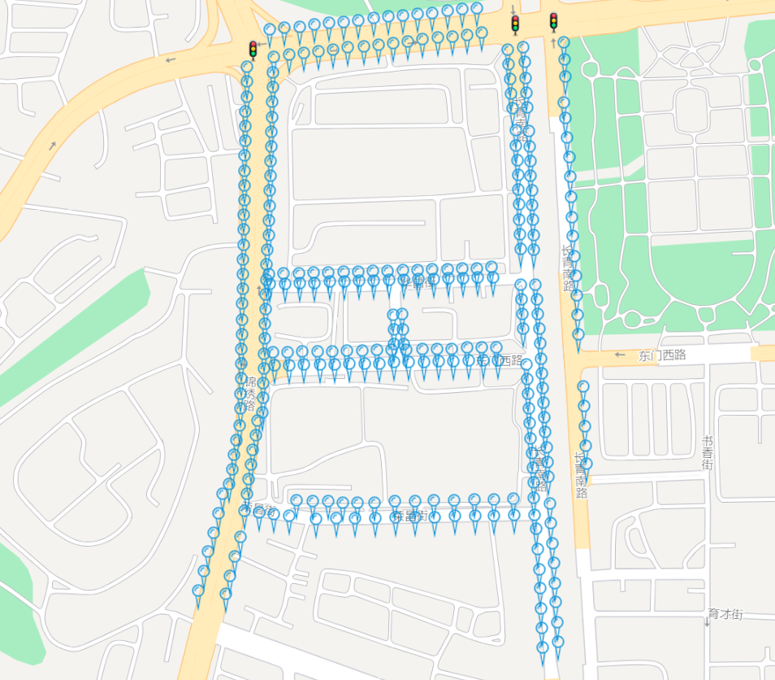
        <figcaption style="text-align: center;">#848 Gateway Distribution</figcaption>
    </figure>
</div>


### #1136 Dataset
- Number of sensor nodes: 1136
- Number of relay nodes: 366
- Data format: CSV (Comma-Separated Values)
- Files:
  - `sensor_1136.xls`: Contains sensor node information with columns "id", "Lng" (longitude), and "Lat" (latitude).
  - `relay_1136.xls`: Contains relay node information with columns "id", "Lng" (longitude), and "Lat" (latitude).
- Coordinate System: WGS 84 (World Geodetic System 1984)


<!-- - 显示节点分布图像 -->
<div style="display: flex; justify-content: space-between;">
    <figure style="width: 49%; margin-right: 10px;">
        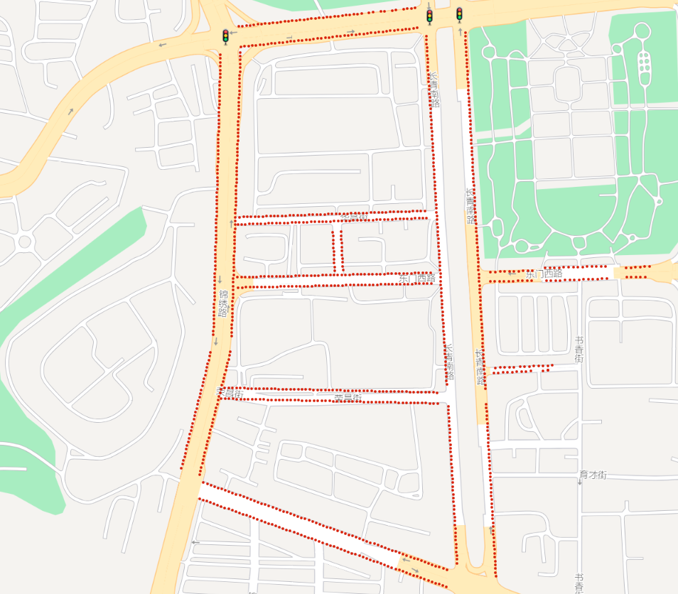
        <figcaption style="text-align: center;">#1136 Sensor Distribution</figcaption>
    </figure>
    <figure style="width: 49%;">
        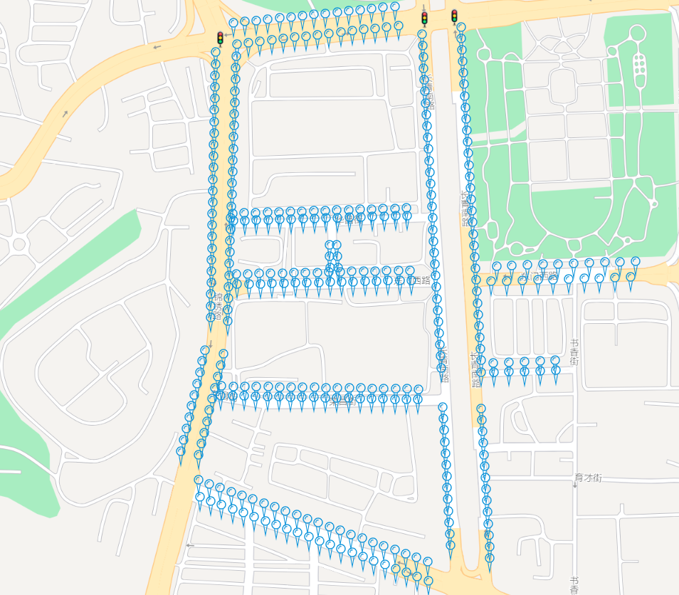
        <figcaption style="text-align: center;">#1136 Gateway Distribution</figcaption>
    </figure>
</div>


### #1500 Dataset
- Number of sensor nodes: 1500
- Number of relay nodes: 497
- Data format: CSV (Comma-Separated Values)
- Files:
  - `sensor_1500.xls`: Contains sensor node information with columns "id", "Lng" (longitude), and "Lat" (latitude).
  - `relay_1500.xls`: Contains relay node information with columns "id", "Lng" (longitude), and "Lat" (latitude).
- Coordinate System: WGS 84 (World Geodetic System 1984)

<!-- - 显示节点分布图像 -->
<div style="display: flex; justify-content: space-between;">
    <figure style="width: 49%; margin-right: 10px;">
        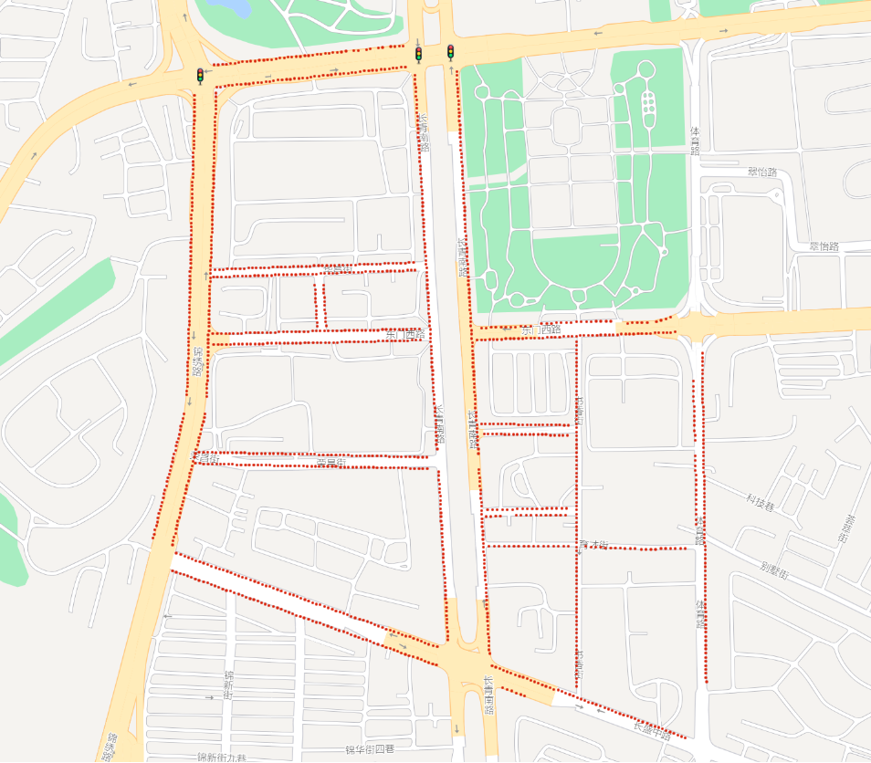
        <figcaption style="text-align: center;">#1500 Sensor Distribution</figcaption>
    </figure>
    <figure style="width: 49%;">
        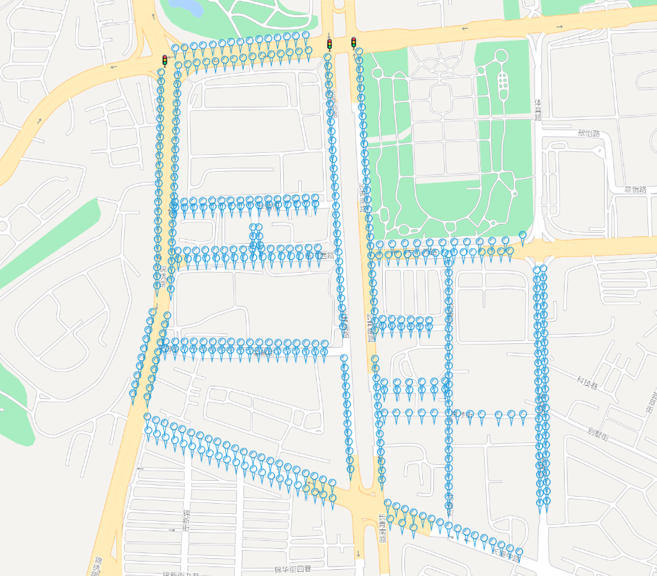
        <figcaption style="text-align: center;">#1500 Gateway Distribution</figcaption>
    </figure>
</div>


## Data License
[CC-BY 4.0](./LICENSE) license.


## Citation

If you utilize this dataset in your research or project, we kindly request you to cite the following:
```
[Insert the citation details of the paper where this dataset is introduced or published]
```

## Contact Information

If you have any inquiries or require further assistance regarding the dataset, please feel free to contact us.


