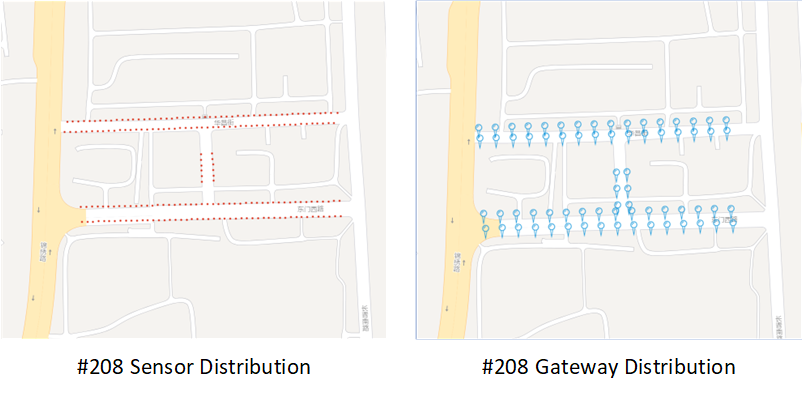
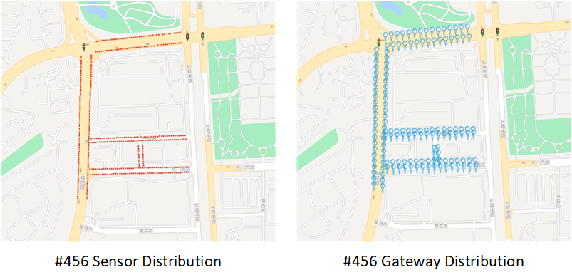
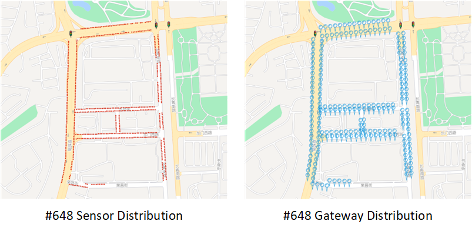
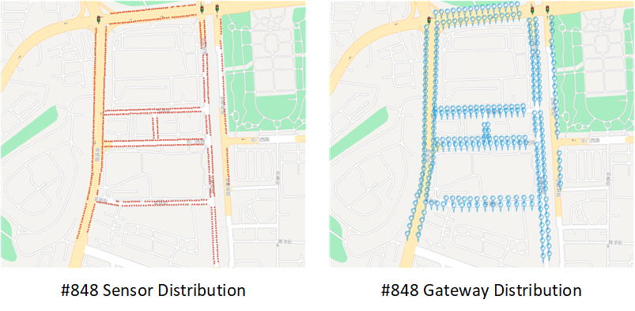
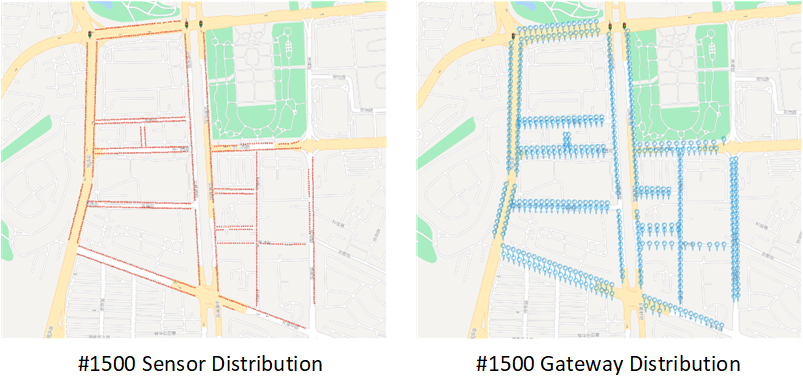

# Relay node placement Dataset for wireless on-street parking sensor networks

Welcome to the Relay Node Placement Dataset for Wireless On-Street Parking Sensor Networks repository! This dataset has been developed for research and analysis in the realm of urban parking management and intelligent transportation systems. It emphasizes the placement of relay nodes in wireless sensor networks for on-street parking. The dataset encompasses two principal sets of data: the parking sensor node set and the relay node set. Each set comprises essential latitude and longitude coordinates, pivotal for evaluating wireless sensor network performance and determining optimal locations for relay nodes.

## Description
**Derived from Urban Parking Scenarios**: The data in this dataset is sourced from diverse urban parking environments, ensuring relevance and representation of varied on-street parking conditions. This focus on real-world urban parking scenarios allows the dataset to offer valuable insights for research in smart parking solutions and intelligent transportation system applications.

## Usage

This dataset is available for academic, research, or commercial use. If you find this dataset useful for your endeavors, please consider citing our accompanying paper and linking back to this repository.

## Dataset Details
| Dataset Name   | Sensor Nodes | Relay Nodes | Data Format | Sensor File         | Relay File          | Coordinate System |
|----------------|--------------|-------------|-------------|---------------------|---------------------|-------------------|
| #208 Dataset   | 208          | 70          | CSV         | sensor_208.xls   | relay_208.xls    | WGS 84            |
| #456 Dataset   | 456          | 148          | CSV         | sensor_456.xls      | relay_456.xls       | WGS 84            |
| #648 Dataset   | 648          | 223          | CSV         | sensor_648.xls   | relay_648.xls    | WGS 84            |
| #848 Dataset   | 848          | 290         | CSV         | sensor_848.xls   | relay_848.xls    | WGS 84            |
| #1136 Dataset   | 1136          | 366         | CSV         | sensor_1136.xls      | relay_1136.xls       | WGS 84            |
| #1500 Dataset   | 1500          | 497         | CSV         | sensor_1500.xls   | relay_1500.xls    | WGS 84            |

### #208 Dataset
- Number of sensor nodes: 208
- Number of relay nodes: 70
- Data format: CSV (Comma-Separated Values)
- Files:
  - `sensor_208.xls`: Contains sensor node information with columns "id", "Lng" (longitude), and "Lat" (latitude).
  - `relay_208.xls`: Contains relay node information with columns "id", "Lng" (longitude), and "Lat" (latitude).
- Coordinate System: WGS 84 (World Geodetic System 1984)
  



### #456 Dataset
- Number of sensor nodes: 456
- Number of relay nodes: 148
- Data format: CSV (Comma-Separated Values)
- Files:
  - `sensor_456.xls`: Contains sensor node information with columns "id", "Lng" (longitude), and "Lat" (latitude).
  - `relay_456.xls`: Contains relay node information with columns "id", "Lng" (longitude), and "Lat" (latitude).
- Coordinate System: WGS 84 (World Geodetic System 1984)



### #648 Dataset
- Number of sensor nodes: 648
- Number of relay nodes: 223
- Data format: CSV (Comma-Separated Values)
- Files:
  - `sensor_648.xls`: Contains sensor node information with columns "id", "Lng" (longitude), and "Lat" (latitude).
  - `relay_648.xls`: Contains relay node information with columns "id", "Lng" (longitude), and "Lat" (latitude).
- Coordinate System: WGS 84 (World Geodetic System 1984)



### #848 Dataset
- Number of sensor nodes: 848
- Number of relay nodes: 290
- Data format: CSV (Comma-Separated Values)
- Files:
  - `sensor_848.xls`: Contains sensor node information with columns "id", "Lng" (longitude), and "Lat" (latitude).
  - `relay_848.xls`: Contains relay node information with columns "id", "Lng" (longitude), and "Lat" (latitude).
- Coordinate System: WGS 84 (World Geodetic System 1984)



### #1136 Dataset
- Number of sensor nodes: 1136
- Number of relay nodes: 366
- Data format: CSV (Comma-Separated Values)
- Files:
  - `sensor_1136.xls`: Contains sensor node information with columns "id", "Lng" (longitude), and "Lat" (latitude).
  - `relay_1136.xls`: Contains relay node information with columns "id", "Lng" (longitude), and "Lat" (latitude).
- Coordinate System: WGS 84 (World Geodetic System 1984)


### #1500 Dataset
- Number of sensor nodes: 1500
- Number of relay nodes: 497
- Data format: CSV (Comma-Separated Values)
- Files:
  - `sensor_1500.xls`: Contains sensor node information with columns "id", "Lng" (longitude), and "Lat" (latitude).
  - `relay_1500.xls`: Contains relay node information with columns "id", "Lng" (longitude), and "Lat" (latitude).
- Coordinate System: WGS 84 (World Geodetic System 1984)




## Data License
[CC-BY 4.0](./LICENSE) license.


## Citation

If you utilize this dataset in your research or project, we kindly request you to cite the following:
```
[Insert the citation details of the paper where this dataset is introduced or published]
```

## Contact Information

If you have any inquiries or require further assistance regarding the dataset, please feel free to contact us.


